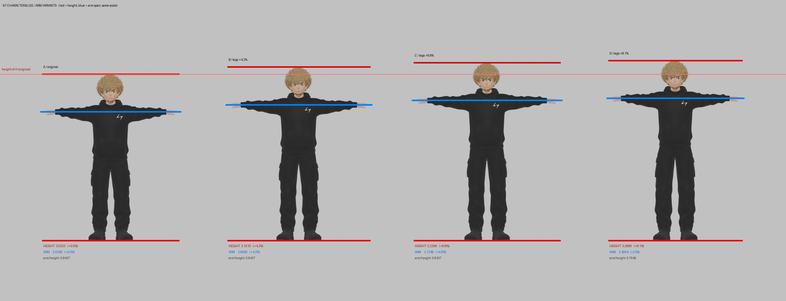

# 67 Character — leg & arm variants

Live viewer: https://oscarbrendonn.github.io/sixseven-final-uclu/

Four variants of the same locked 67 character. Identical texture and colour (4K, no decimation).
Head, hair, hands and shoes are untouched in every variant.

| variant | height | vs A | arm span | vs A | arm/height | legs |
|---|---|---|---|---|---|---|
| **A · original** | 3.0233 | — | 2.5508 | — | 0.8437 | untouched |
| **B** | 3.1510 | +4.2% | 2.6585 | +4.2% | 0.8437 | stretched ×1.13 |
| **C** | 3.2296 | +6.8% | 2.7248 | +6.8% | 0.8437 | stretched ×1.21 |
| **D** | 3.2689 | +8.1% | 2.4994 | -2.0% | 0.7646 | ×1.25 + widened |

## Method

- **Leg stretch** — everything above the hip (40% of height) stays fixed; hip→ankle is stretched
  vertically; the shoe moves down rigidly, so its shape is never deformed.
- **Arm stretch** — shoulder stays fixed, arm is stretched outward, the hand shifts rigidly
  (hands never grow). A, B, C carry a ×1.04 base arm stretch; B and C get extra compensation so
  that **arm/height stays at 0.8437** — the proportion of the visual reference.
- **Hoodie hem / oversize cut / leg width** — shaped by hand with lattices, then baked.
- Texture stretches vertically where the mesh was stretched, but the garment is flat black,
  so it is invisible.

Files: `orijinal.glb` · `f113.glb` · `f121.glb` · `uzunbacak.glb` (~4.7 MB each, Draco + 2K webp)
